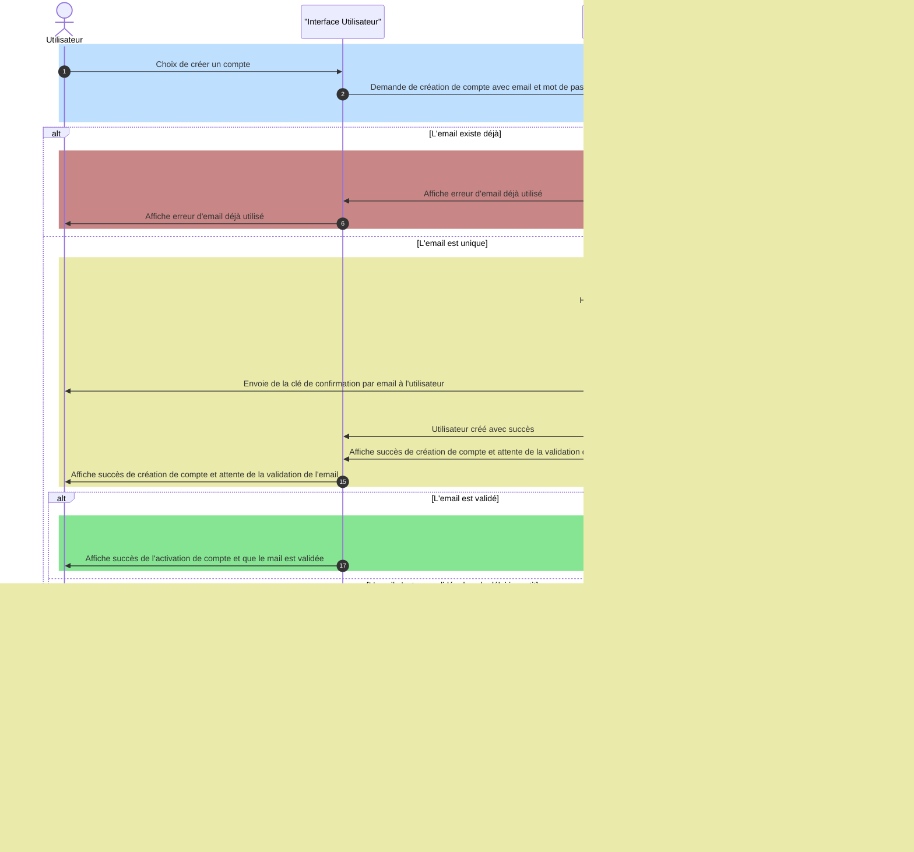

### Création de compte utilisateur

```mermaid
sequenceDiagram
    autonumber
    actor U as Utilisateur
    participant UI as "Interface Utilisateur"
    participant S as Serveur
    participant DB as "Base de Données"

    rect rgb(191, 223, 255)
        U->>UI: Choix de créer un compte
        UI->>S: Demande de création de compte avec email et mot de passe
        S->>DB: Vérifie si l'email existe déjà
    end
    alt L'email existe déjà
        rect rgb(201 134 134)
            DB->>S: Email déjà utilisé
            S->>UI: Affiche erreur d'email déjà utilisé
            UI->>U: Affiche erreur d'email déjà utilisé
        end
    else L'email est unique
        rect rgb(234 235 171)
            DB->>S: Email unique confirmé
            S->>S: Hache le mot de passe
            S->>DB: Crée le nouvel utilisateur
            S->>DB: Création de la clé de confirmation de l'email
            S->>U: Envoie de la clé de confirmation par email à l'utilisateur
            DB->>S: Confirmation de création de l'utilisateur
            S->>UI: Utilisateur créé avec succès
            S->>UI: Affiche succès de création de compte et attente de la validation de l'email
            UI->>U: Affiche succès de création de compte et attente de la validation de l'email
        end
        alt L'email est validé
            rect rgb(134 229 146)
                S->>DB: Indication que l'email est correct et le compte est activé
                UI->>U: Affiche succès de l'activation de compte et que le mail est validée
            end
        else L'email n'est pas validée dans le délai impartit
                rect rgb(234 235 171)
                    S->>U: Envoie un mail de rappel à l'utilisateur
                end
            alt L'email est validé
                rect rgb(134 229 146)
                    S->>DB: Indication que l'email est correct et le compte est activé
                    UI->>U: Affiche succès de l'activation de compte et que le mail est validée
                end
            else L'email n'est pas validé apès le temps impartit
                rect rgb(201 134 134)
                    S->>DB: Le compte est supprimé
                end
            end
        end
    end


```
