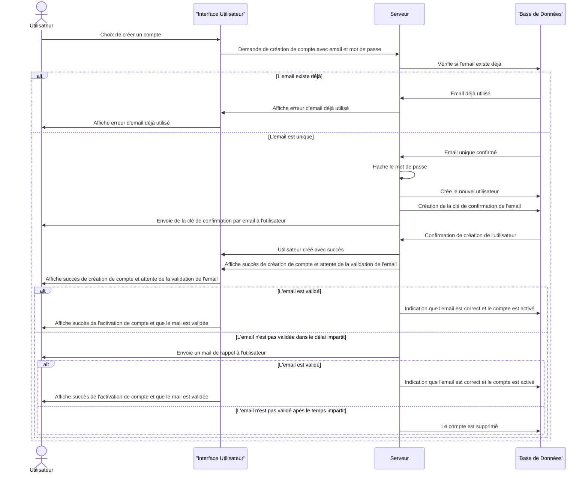

### Création de compte utilisateur

```mermaid
sequenceDiagram
    actor U as Utilisateur
    participant UI as "Interface Utilisateur"
    participant S as Serveur
    participant DB as "Base de Données"

    U->>UI: Choix de créer un compte
    UI->>S: Demande de création de compte avec email et mot de passe
    S->>DB: Vérifie si l'email existe déjà
    alt L'email existe déjà
        DB->>S: Email déjà utilisé
        S->>UI: Affiche erreur d'email déjà utilisé
        UI->>U: Affiche erreur d'email déjà utilisé
    else L'email est unique
        DB->>S: Email unique confirmé
        S->>S: Hache le mot de passe
        S->>DB: Crée le nouvel utilisateur
        S->>DB: Création de la clé de confirmation de l'email
        S->>U: Envoie de la clé de confirmation par email à l'utilisateur
        DB->>S: Confirmation de création de l'utilisateur
        S->>UI: Utilisateur créé avec succès
        S->>UI: Affiche succès de création de compte et attente de la validation de l'email
        UI->>U: Affiche succès de création de compte et attente de la validation de l'email
        alt L'email est validé
            S->>DB: Indication que l'email est correct et le compte est activé
            UI->>U: Affiche succès de l'activation de compte et que le mail est validée
        else L'email n'est pas validée dans le délai impartit
                S->>U: Envoie un mail de rappel à l'utilisateur
            alt L'email est validé
                S->>DB: Indication que l'email est correct et le compte est activé
                UI->>U: Affiche succès de l'activation de compte et que le mail est validée
            else L'email n'est pas validé apès le temps impartit
                S->>DB: Le compte est supprimé
            end
        end
    end


```
