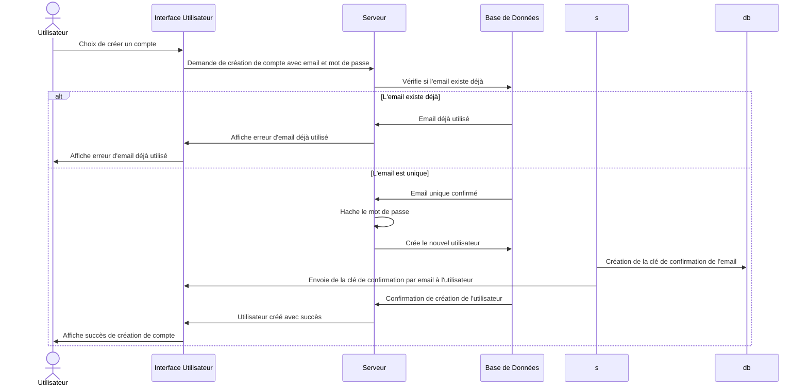

### Création de compte utilisateur

```mermaid
sequenceDiagram
    actor U as Utilisateur
    participant UI as Interface Utilisateur
    participant S as Serveur
    participant DB as Base de Données

    U->>UI: Choix de créer un compte
    UI->>S: Demande de création de compte avec email et mot de passe
    S->>DB: Vérifie si l'email existe déjà
    alt L'email existe déjà
        DB->>S: Email déjà utilisé
        S->>UI: Affiche erreur d'email déjà utilisé
        UI->>U: Affiche erreur d'email déjà utilisé
    else L'email est unique
        DB->>S: Email unique confirmé
        S->>S: Hache le mot de passe
        S->>DB: Crée le nouvel utilisateur
        s->>db: Création de la clé de confirmation de l'email
        s->>UI: Envoie de la clé de confirmation par email à l'utilisateur
        DB->>S: Confirmation de création de l'utilisateur
        S->>UI: Utilisateur créé avec succès
        UI->>U: Affiche succès de création de compte
    end

```
