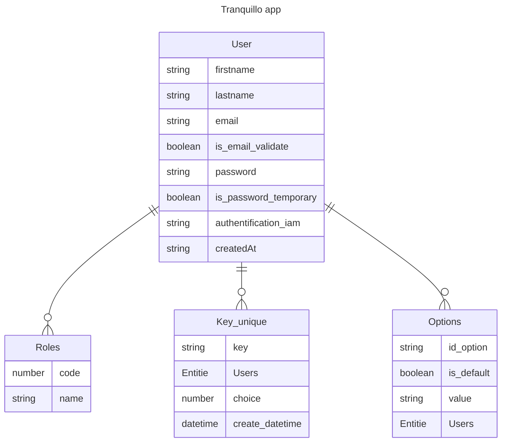

# BASE DE DONNÉES {.text-success}

## MCD

> Entités :

Users
Roles
Key_unique
Options

> Propriétés :

**Users :**

|                       |           |
| --------------------- | --------- |
| **email**             | (string)  |
| firstname             | (string)  |
| lastname              | (string)  |
| is_email_validate     | (boolean) |
| password              | (string)  |
| is_password_temporary | (boolean) |
| authentification_iam  | (string)  |
| _Roles_               |           |
| createdAt             | (date)    |

**Roles :**

|          |          |
| -------- | -------- |
| **code** | (string) |
| name     | (string) |

**Clés Uniques :**

|                 |            |
| --------------- | ---------- |
| **key**         | (UUID)     |
| _User_          |            |
| choice          | (number)   |
| create_datetime | (datetime) |

**Options :**

|                |           |
| -------------- | --------- |
| **id_options** |           |
| name_option    | (string)  |
| _User_         |           |
| is_default     | (boolean) |
| value_option   | (string)  |

> Relations :

- Un utilisateur peut avoir un seul rôle, mais un rôle peut être attribué à plusieurs utilisateurs.
  - Relation `1-N` entre Utilisateur et Rôles (User - Roles).
- Un utilisateur peut générer plusieurs clés uniques, mais chaque clé unique est associée à un seul utilisateur.
  - Relation `1-N` entre Utilisateur et Clés Uniques (User - Key_unique).
- Un utilisateur peut avoir plusieurs options, mais chaque option est liée à un seul utilisateur.
  - Relation `1-N` entre Utilisateur et Options (User - Options).

Relations :
(User) 1 ---- N (Roles)
(User) 1 ---- N (Key_unique)
(User) 1 ---- N (Options)

